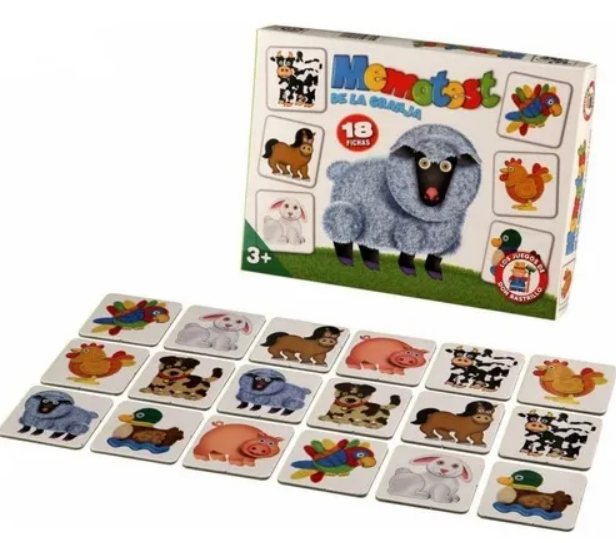

## The Challenge

Scientific research often remains inaccessible to the general public, despite containing valuable insights that could drive meaningful environmental engagement. While academic databases like SLU.se provide comprehensive species information in structured formats, they primarily serve the scientific community rather than fostering broader environmental awareness among urban residents.

This project bridges the gap between rigorous research from Chalmers University of Technology (specifically PhD research by Eldesoky on urban biodiversity in Gothenburg) and public engagement. The challenge was to transform complex ecological data into an interactive experience that promotes environmental consciousness without sacrificing scientific accuracy.

Currently, platforms like SLU display species information in highly technical formats suitable for researchers but potentially overwhelming for citizens who share urban spaces with these species. See below how traditional scientific databases present information:


<div style="text-align: center;">

</div>

At NODAL, we believe research quality should not be compromised for public engagement. Instead, sophisticated communication strategies should make complex ecological concepts both accessible and meaningful. The central questions driving this project were: How can urban residents develop deeper connections with the bird species they share their city with? How can we effectively raise awareness about urban biodiversity's critical importance? 

---

## Our Solution

### Multi-Modal Learning Approach
Through extensive data exploration and source analysis, we identified an opportunity to showcase Gothenburg's diverse bird species through interactive gameplay. Our hypothesis centers on multi-sensory engagement: by combining visual recognition, auditory identification, and tactile interaction, users develop stronger empathetic connections with urban wildlife and increased environmental awareness.

### Gamification Strategy
Drawing inspiration from classic educational games, we reimagined the traditional memory card game as a sophisticated learning platform. The familiar gameplay mechanics of card matching provide an accessible entry point while progressive difficulty levels introduce scientific terminology and audio identification challenges.

<div style="text-align: center;">

</div>

The solution integrates traditional memory game mechanics with two innovative variations designed to enhance environmental consciousness and species knowledge among Gothenburg residents.

## What We Built

### Core Game Architecture

We developed a sophisticated web application that transforms the classic memory card game into a comprehensive bird learning platform. The application features progressive difficulty levels, starting with visual matching and advancing to scientific nomenclature and audio identification challenges.

### Technical Implementation

The platform leverages R and Shiny framework to create an interactive web application that bridges data science and user experience design. Our data pipeline begins with species occurrence data from PhD research conducted at Chalmers University, which informs the selection of birds actually present in Gothenburg's urban environment.

#### System Architecture

```
┌───────────────────────────────────────────────────────────────────────────┐
│                              DATA SOURCES                                 │
├─────────────────┬─────────────────┬─────────────────┬─────────────────────┤
│   Chalmers      │     SLU.se      │   Cornell Lab   │   Quality Control   │
│   Research      │   (Artfakta)    │   of Ornithology│   & Validation      │
│                 │                 │                 │                     │
│ • Species List  │ • Official      │ • Backup Audio  │ • Image Quality     │
│ • Occurrence    │   Images        │ • Additional    │ • Audio Clarity     │
│   Data          │ • Audio Files   │   Coverage      │ • Data Consistency  │
│ • Biodiversity  │ • Scientific    │ • Global        │                     │
│   Research      │   Names         │   Database      │                     │
└─────────┬───────┴─────────┬───────┴─────────┬───────┴─────────────────────┘
          │                 │                 │
          ▼                 ▼                 ▼
┌───────────────────────────────────────────────────────────────────────────┐
│                           DATA PROCESSING                                 │
├───────────────────────────────────────────────────────────────────────────┤
│                      Automated Web Scraping                               │
│                                                                           │
│  ┌─────────────────┐    ┌──────────────────┐    ┌─────────────────────┐   │
│  │   Image         │    │   Audio          │    │   Content           │   │
│  │   Collection    │    │   Processing     │    │   Validation        │   │
│  │                 │    │                  │    │                     │   │
│  │ • High-res      │    │ • Compression    │    │ • Species Matching  │   │
│  │   Download      │    │   (70-85%)       │    │ • Data Quality      │   │
│  │ • Format        │    │ • Format         │    │ • Error Handling    │   │
│  │   Standard      │    │   Conversion     │    │                     │   │
│  └─────────────────┘    └──────────────────┘    └─────────────────────┘   │
└─────────────────────────────┬─────────────────────────────────────────────┘
                              │
                              ▼
┌───────────────────────────────────────────────────────────────────────────┐
│                        APPLICATION LAYER                                  │
├───────────────────────────────────────────────────────────────────────────┤
│                            R Shiny Framework                              │
│                                                                           │
│  ┌──────────────┐  ┌──────────────┐  ┌──────────────┐  ┌──────────────┐   │
│  │   Server     │  │     UI       │  │   Modules    │  │   Global     │   │
│  │   Logic      │  │  Components  │  │              │  │   Config     │   │
│  │              │  │              │  │ • Card Game  │  │              │   │
│  │ • Game State │  │ • Responsive │  │ • Audio      │  │ • Species    │   │
│  │ • Audio      │  │   Design     │  │   Player     │  │   Data       │   │
│  │   Handling   │  │ • Bootstrap  │  │ • Score      │  │ • Media      │   │
│  │ • Score      │  │   Themes     │  │   Tracking   │  │   Paths      │   │
│  │   Management │  │ • JavaScript │  │              │  │              │   │
│  └──────────────┘  └──────────────┘  └──────────────┘  └──────────────┘   │
└─────────────────────────────┬─────────────────────────────────────────────┘
                              │
                              ▼
┌───────────────────────────────────────────────────────────────────────────┐
│                          DEPLOYMENT                                       │
├───────────────────────────────────────────────────────────────────────────┤
│                                                                           │
│  ┌─────────────────────┐              ┌─────────────────────────────────┐ │
│  │   Local Media       │              │        Cloud Hosting            │ │
│  │   Storage           │              │       (shinyapps.io)            │ │
│  │                     │              │                                 │ │
│  │ • Compressed MP3s   │    ───────>  │ • Scalable Deployment           │ │
│  │ • Optimized Images  │              │ • Global Accessibility          │ │
│  │ • Backup System     │              │ • Performance Monitoring        │ │
│  └─────────────────────┘              └─────────────────────────────────┘ │
│                                                                           │
│                    Dual Fallback System                                   │
│              (Local Files ← → Web Scraping)                               │
└───────────────────────────────────────────────────────────────────────────┘
```

### Data Integration Strategy

The application employs a robust data collection approach:
- Primary species list derived from academic research on Gothenburg's urban biodiversity
- Automated web scraping of SLU.se for official species imagery and audio recordings
- Secondary source integration with Cornell's bird database for comprehensive coverage
- Quality control protocols ensuring high-resolution imagery and audio clarity

Below you can see the application in action:

<div style="text-align: center;">

</div>

### Game Mode 1: Scientific Nomenclature Challenge

The first advanced mode challenges users to match bird imagery with corresponding scientific names, introducing taxonomic literacy while maintaining engaging gameplay mechanics. This mode bridges visual recognition with formal biological classification systems.

### Game Mode 2: Audio Identification

The second mode presents the most sophisticated challenge: audio-based species identification. Users listen to authentic bird calls and songs, then match these sounds to corresponding visual representations. This mode develops auditory recognition skills essential for real-world bird observation and urban wildlife appreciation.


## Capabilities We Delivered

### Interactive Learning Platform

The application provides four distinct interaction modes designed to accommodate different learning preferences and skill levels:

- **Classic Memory Game**: Traditional card-matching mechanics with bird imagery
- **Scientific Name Matching**: Advanced mode pairing images with taxonomic nomenclature
- **Audio Identification**: Sound-based species recognition challenges
- **Species Browser**: Comprehensive exploration tool with detailed species information

### Technical Architecture

We designed a robust, scalable platform that manages complex media workflows and data integration:

- **Modular R Shiny Framework**: Component-based architecture enabling maintainable code expansion
- **Automated Web Scraping**: Dynamic content retrieval from authoritative scientific databases
- **Audio Optimization**: Intelligent compression algorithms reducing file sizes by 70-85% while preserving audio quality
- **Responsive Design**: Cross-platform compatibility with modern web standards

### Performance Optimization

The platform implements sophisticated performance strategies:

- **Dual Fallback System**: Local media files with web scraping backup for reliability
- **Compressed Media Pipeline**: Optimized audio and image delivery for faster loading
- **Modular Loading**: Dynamic content loading based on user interaction patterns

## Innovation

### Data-Driven Educational Design

We developed an innovative approach that combines rigorous scientific data with engaging user experience design. The platform successfully transforms complex ecological research into accessible, interactive learning experiences without compromising scientific accuracy.

### Multi-Modal Learning Integration

The application pioneers the integration of visual, auditory, and cognitive learning modalities within a single gaming framework, creating comprehensive species identification skills that transfer to real-world urban wildlife observation.

### Scalable Content Management

Our automated content pipeline enables rapid expansion to new geographic regions or species groups, making the platform adaptable for diverse urban ecology education initiatives.

## Project Impact

### Educational Outcomes

**Birds of Gothenburg** represents a successful fusion of academic research and public engagement, demonstrating how complex ecological data can be transformed into meaningful learning experiences. The platform promotes urban biodiversity awareness through multi-sensory engagement, combining visual recognition, taxonomic learning, and auditory identification skills.

### Environmental Consciousness

The application contributes to broader environmental education goals by fostering emotional connections between urban residents and local wildlife. By making bird identification accessible and enjoyable, the platform encourages real-world observation and appreciation of urban ecosystems.

### Scalable Model

This project establishes a replicable framework for translating scientific research into public engagement tools, providing a model for other cities and research institutions seeking to bridge the gap between academic knowledge and community awareness.

---

**Our Approach**: Multi-modal learning design • Data-driven content strategy • Gamification principles
**Technology Stack**: R • Shiny • Web Scraping • Audio Processing • Responsive Design
**Project Status**: Open source | Production deployment | Active development

**Interested in developing interactive educational platforms or transforming research data into engaging public tools?** Contact NODAL to explore how we can create custom solutions that bridge scientific rigor with accessible user experiences.
